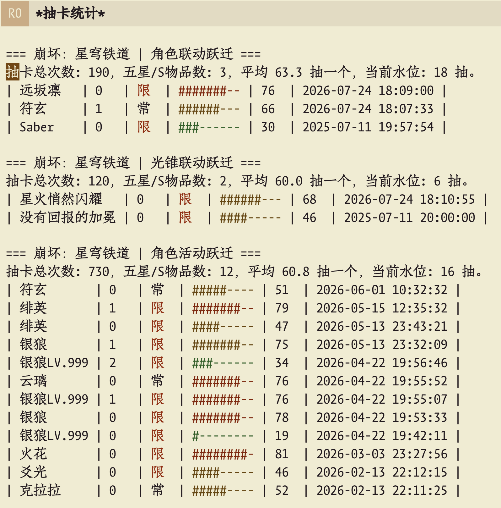
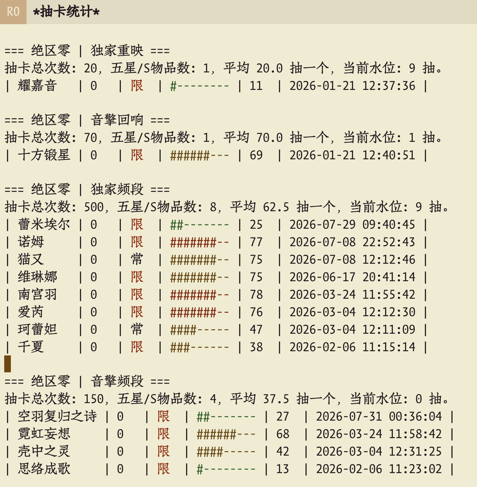

* hoyogacha.el
Emacs 中的米哈游抽卡记录管理器

* 目前功能
- [X] 支持国服相关数据
- [X] 获取抽卡记录链接
- [-] 自动抓取祈愿记录
  - [X] 拼接记录链接
  - [ ] 实现轮询导入
- [X] 导入UIGF v4.1+ 标准的 json 数据
- [X] 保存数据到本地，以 UIGF v4.1+ 标准
- [X] 展示统计 buffer

* 示例图

* 使用例
** 依赖

本插件需要以下依赖：

[[https://github.com/alphapapa/plz.el][plz]]： 一个 Emacs 的 HTTP 客户端库。

请确保在您的 Emacs 配置中已经安装并加载了这些包。
** 安装与配置

将 =hoyogacha.el= 文件放置到您的 Emacs =load-path= 中。

在您的 Emacs 配置文件 (如 =init.el= ) 中添加以下代码：

#+begin_src elisp
(use-package plz :ensure t)
(require 'hoyogacha)
#+end_src

或者在31之后的Emacs中，通过内置的vc方式下载：
#+begin_src elisp
(use-package bangumi :demand t
  :vc (:url "git@github.com:TomoeMami/hoyogacha.el"
            :rev :newest))
#+end_src

如果愿意从我的自建ELPA 安装：
#+begin_src elisp
(add-to-list 'package-archives
                 '("TomoELPA" . "https://tomoemami.github.io/tomoelpa/snapshots/"))
(list-packages)
(package-install 'hoyogacha)
#+end_src
** 使用方法
配置用于存储数据文件的路径：
#+begin_src elisp
(use-package hoyogacha
  :custom
  (hoyogacha-data-save-file "/path/to/your/data.json"))
#+end_src

可选：配置自动导入的路径，启动时会从该路径中导入符合 UIGF 标准的 json 文件：
#+begin_src elisp
(use-package hoyogacha
  :custom
  (hoyogacha-data-save-file "/path/to/your/data.json")
  (hoyogacha-data-import-dir "/path/to/your/import/dir"))
#+end_src

由于目前还未做好链接抓取功能，因此设置好了这些之后直接 =M-x= 执行 =hoyogacha-show= 就行了，选择你需要处理的游戏。
* 参考项目
- https://github.com/lgou2w/HoYo.Gacha
- https://gist.githubusercontent.com/Star-Rail-Station/2512df54c4f35d399cc9abbde665e8f0/raw/get_warp_link_cn.ps1?cachebust=srs
- https://github.com/vikiboss/gs-helper
- https://github.com/Summer-Neko/NekoGame

